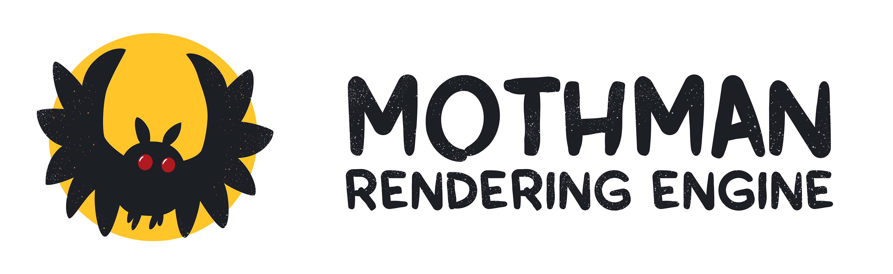
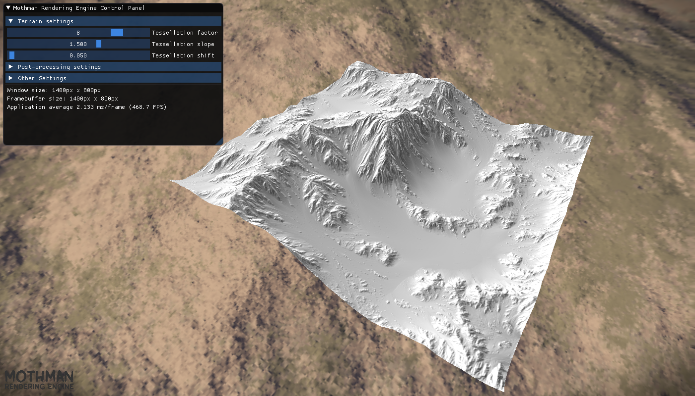
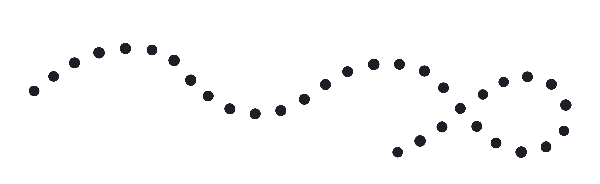

  

Mothman Rendering Engine - Modern OpenGL rendering engine coded for learning purposes.

## Features
- Forward multipass rendering
- Tessellated terrain system
- Post-processing effects (invert, grayscale, edge detection, color correction, vignette, logo overlay)
- Assimp model loading
- Shader uniforms registration
- Directional, point and spot lights
- Directional light shadows
- Omni-directional light shadows
- Phong shading model
- Textures
- Simple materials
- Normal maps
- Skybox
- ImGui based graphical user interface
- Resizable window

## Screenshots

  

  

Tesselation

## Third Party Dependencies
- GLFW
- GLM
- GLEW
- Assimp
- ImGui

## Notes
Please compile the project with x86 as target platform.
Heavy refactoring is in progress.

  

